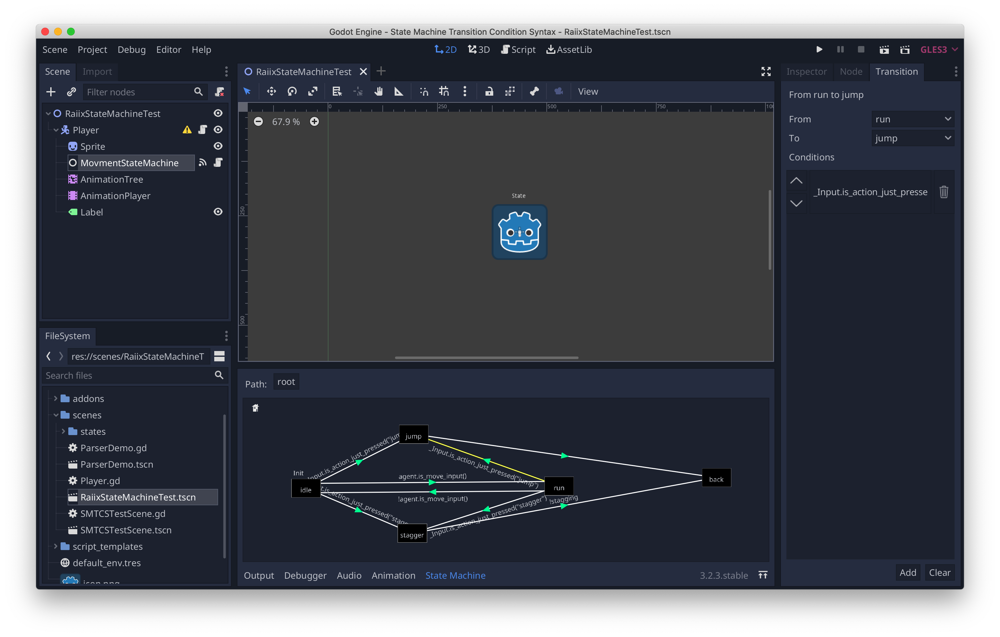

# 适用于Godot的有限状态机(FSM)插件
## 特性
- 每个状态机和状态是一个节点
- 状态可以拥有子状态机
- 转换条件为一个逻辑表达式语句(字符串)，可访问调用状态以及状态机拥有者的变量和方法 
- 状态机可视化编辑器
- 状态机远程调试器

## 使用方法
可直接运行本项目的`scenes/RaiixStateMachineTest.tscn`示例场景，打开菜单项`Project/Tools/State MachineRemote Viewer`弹出远程状态机窗口，在场景树中`双击`一个状态机节点即可查看该状态机的状态。

在编辑器场景视图中选中`MovementStateMachine`即可在下方面板编辑该状态机，可进行状态的添加、连接、编辑等操作。

若要新建一个状态机，则直接添加一个`StateMachine`节点，然后在编辑状态机面板中创建状态机资源即可进行编辑。

## 已知Bug
每次打开项目进行一次场景保存，或者运行一次场景，然后关闭该插件，则会出现空引用调用的错误，不用管他，再次开启插件，然后之后的操作都会正常了。

## 远程调试状态机的原理

在启用该插件的时候会添加一个`AutoLoad`节点，即自动加载，这个节点叫做`RemoteDubegClient`，而插件本身则加载一个`RemoteDebugServer`节点。

`RemoteDebugServer`会启用一个TCP服务器，监听`25561`端口。

`RemoteDebugClient`则会在游戏启动的时候自动加载，连接本地`25561`上的服务器。

之后便是`RemoteDebugClient`与`RemoteDebugServer`直接的通信：服务器会请求获取客户端的场景树信息，以及某特定状态机的信息，然后在一个窗口中显示出来，达到远程调试的目的。

> 若要关闭此功能，修改`res://addons/raiix_statemachine/RemoteDebug/RemoteDebugClient.gd`文件中的`enable`变量为`false`即可，在游戏运行后该节点会自动删除。

## 许可证
MIT

## 广而告之
您的赞助将是对开发者的极大鼓励！

**哔哩哔哩**

<https://space.bilibili.com/15155009>

**爱发电**

<https://afdian.net/@raiix>